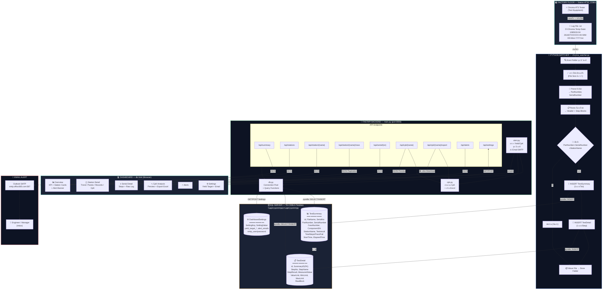
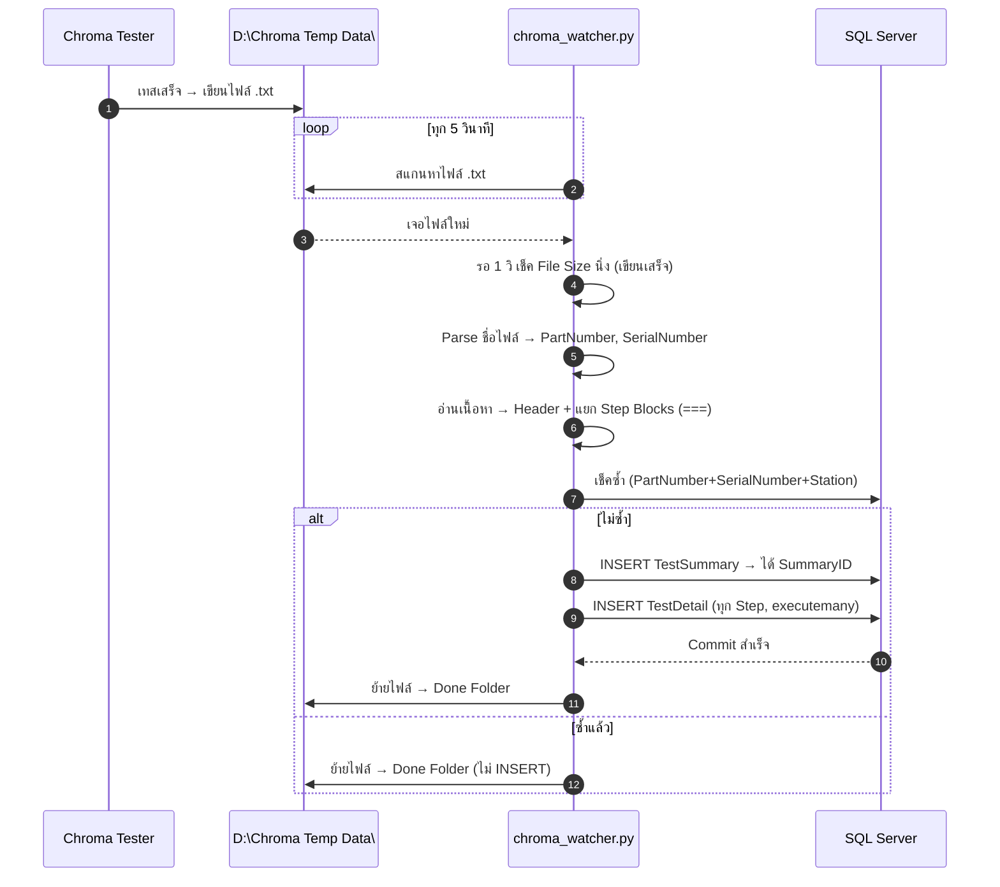
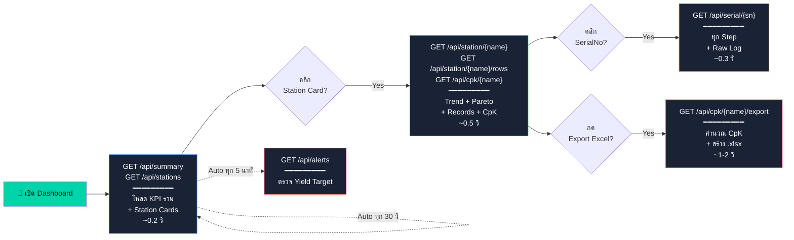
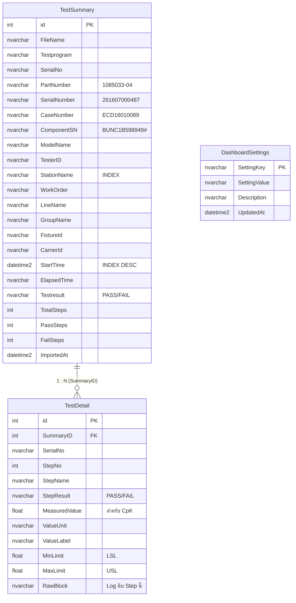
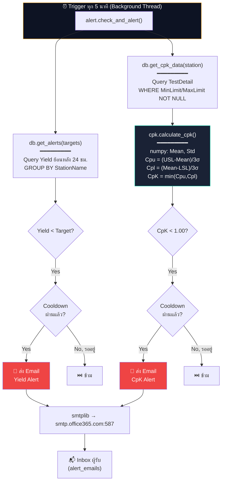
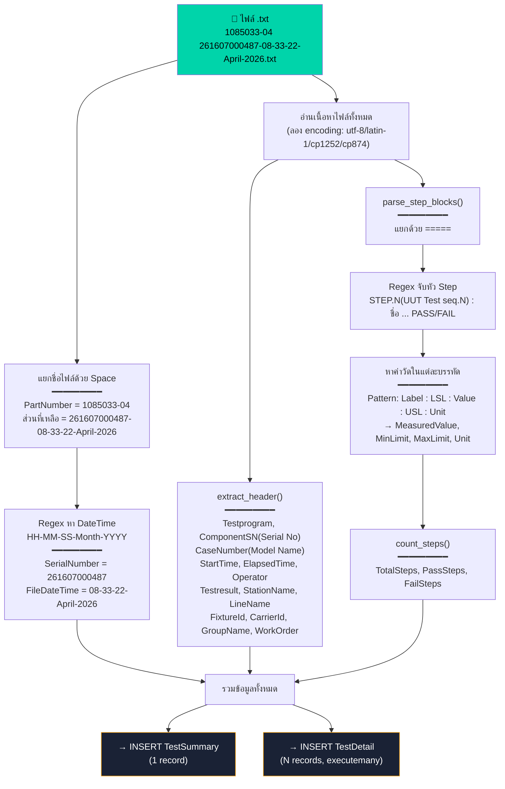

# TE-CDBU1 Factory System — Block Diagram

ระบบทั้งหมดของ TE-CDBU1: จากเครื่องเทส Chroma → SQL Server → Dashboard

---

## 1. ภาพรวมทั้งระบบ (Full System Overview)

---

## 2. Pipeline การ Import ข้อมูล (Data Ingestion Flow)

---

## 3. Lazy Load Flow บน Dashboard

---

## 4. Database Schema (ER Diagram)

---

## 5. CpK & Alert Flow

---

## 6. Step Parsing Logic (chroma_watcher.py)

---

## สรุปไฟล์ทั้งหมดในระบบ

| ไฟล์ | ภาษา | หน้าที่ |
|------|------|---------|
| `chroma_watcher.py` | Python | จับตามองโฟลเดอร์ → Parse .txt → INSERT SQL (Real-time) |
| `ChromaDataParser.cs` | C# | ทางเลือก: Chroma เรียกตรงเมื่อเทสเสร็จ |
| `db.py` | Python | Connection Pool + Query Functions |
| `cpk.py` | Python | คำนวณ CpK + สร้าง Excel |
| `alert.py` | Python | ตรวจ Yield/CpK ทุก 5 นาที + ส่ง Email |
| `main.py` | Python | FastAPI App รวมทุก Endpoint |
| `db.html` | HTML/JS | Dashboard หน้าเว็บ (Lazy Load) |
